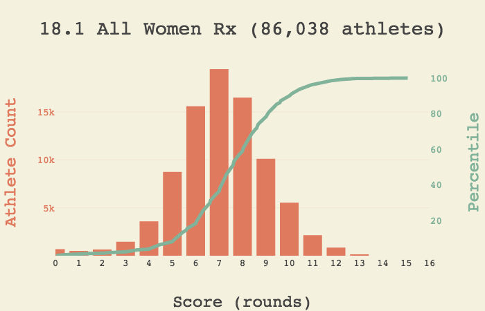

# CrossFit Games Open Statistics
[CrossFit Games Website](https://games.crossfit.com/) is an excellent resource to gauge one's performance against
an entire CrossFit community.  What it lacks is
a rudimentary set of statistics, most notably the percentile -- as opposed to ordinal rank -- of an athlete's performance
for a given Open workout.  The percentiles reported by the mobile CrossFit app are skewed because they include zero scores of every athlete who has not entered them.  Presented here, among other things, are accurate percentiles with demographic, geographic, and skill drill-downs.

## CrossFit Open Percentiles
[This interactive website](https://2deviant.github.io/CrossFitOpen2018/) contains the 2018 CrossFit Games Open workout statistics available to date.  Example:

## Notes
* Demographic categories are renamed to better represent their constituents.  Athletes below the 18-34 age range is commonly referred to as _teenagers_; anyone above as _masters_.

* Only athletes with a non-zero score are included in the analysis.  Thus providing a better measure of the athletic performance of the community, as opposed to timely submission of scores.